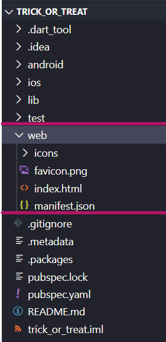
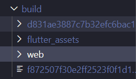
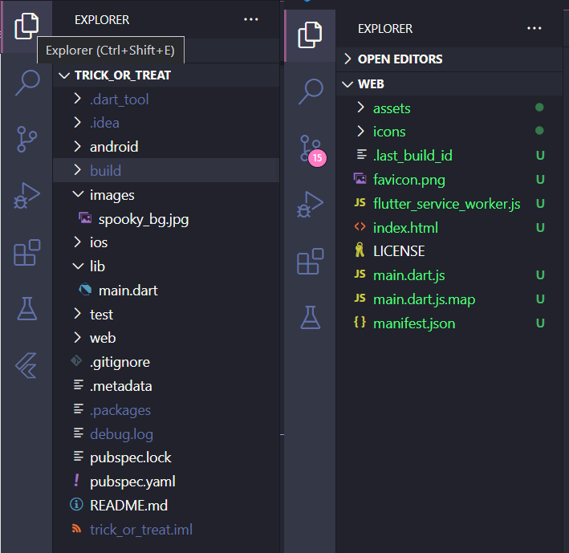
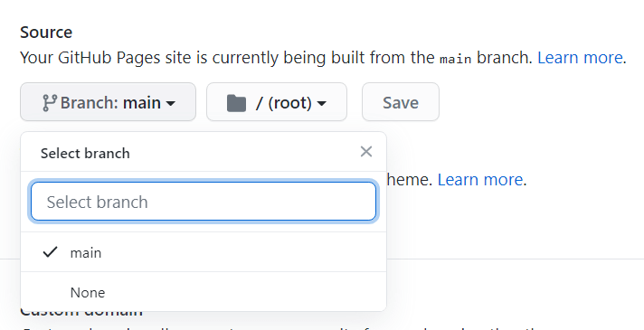

Hey, have you ever wanted to host your flutter web build without much work and confusion? I've got a small trick for you in here. You can even use your existing repository to host a new flutter web build. We'll get into the working right away.

We will be making a trick or treat web app using flutter and host it's release build on GitHub Pages.

<!--truncate-->

:::note

In this example, we will host only the release build of the flutter web and update it, rather than the whole flutter project itself on GitHub (which is simple). This method is quite helpful, if you want to use an existing repository to have the build files.

:::

:::tip

Please use [peanut](https://pub.dev/packages/peanut) and not waste your time reading this if you have some love for your life! The method mentioned here is redundant and not efficient now. Thanks.

:::

## Step 1: Creating a flutter web project.

To create a flutter web project, you have to be in one of the following flutter channels : `beta`, `dev` or `master`. Change your channel and upgrade it, if you were in stable and then proceed to the next step.

:::info

Flutter web is now available in stable channel. There is no real need to switch.

:::

Enable support for `flutter-web` in your terminal:

`$ flutter config --enable-web`

Now, create your flutter project like you usually do and it will have web support. If you want to add web support to an existing project you can use the following command inside the directory:

`$ flutter create .`

After creating your flutter project, you can check if you have the `web` directory. It shows that your project supports `flutter-web`.

The sources for the examples are at the end of this page.

Now, you can also publish it on GitHub.

## Step 2: Making your flutter-web build.

You can make a release build for the flutter-web using the command:

`$ flutter build web --release`

Now, you will have a new directory named `build` and you will find your web build in it, like this.

Now if you look inside that web folder, you will find the build files. As the dart code trans compiles into javascript code with HTML and CSS, the starting point of the build naturally, is the `index.html`.

## Step 3: Publishing the build to GitHub.

You can now start a new repository or clone a repository you already have in a new folder/location .

This is how the cloned repository will look like (mine is just empty).

Then rename it to web and paste it into `flutter-project/build` directory, before really building the web build.

Now, that you have done everything, you can edit your flutter code just like you want, anytime from the flutter-project and build it. Then the changes can be committed and pushed from `flutter-project/build/web`. This reduces our worry to handle the build files to host and maintain two different repositories, one for the flutter project and the other exclusively for hosting.

## Step 4: Hosting it on GitHub Pages.

After you have successfully pushed the build files you got from the flutter project, go to the repository page. Then, navigate to the settings, you will find a title **“GitHub Pages”**. Select your source as main branch and save.

That's it, you have successfully hosted your flutter web build with GitHub pages. Now, you can go to your site and view your beautifully built flutter web app (unlike mine😜), by clicking the link displayed under the same section.

:::tip

You can also use a custom domain instead of just `username.github.io`, by specifying a domain in custom domain section, by following the steps [here](https://docs.github.com/en/pages/configuring-a-custom-domain-for-your-github-pages-site).

:::

You can check the working example [here](https://coder-with-a-bushido.github.io/trick_or_treat_web/#/) .

Repo for the flutter project can be found [here](https://github.com/coder-with-a-bushido/trick_or_treat) and for the respective web build [here](https://github.com/coder-with-a-bushido/trick_or_treat_web).

**HAPPY CODING!**
